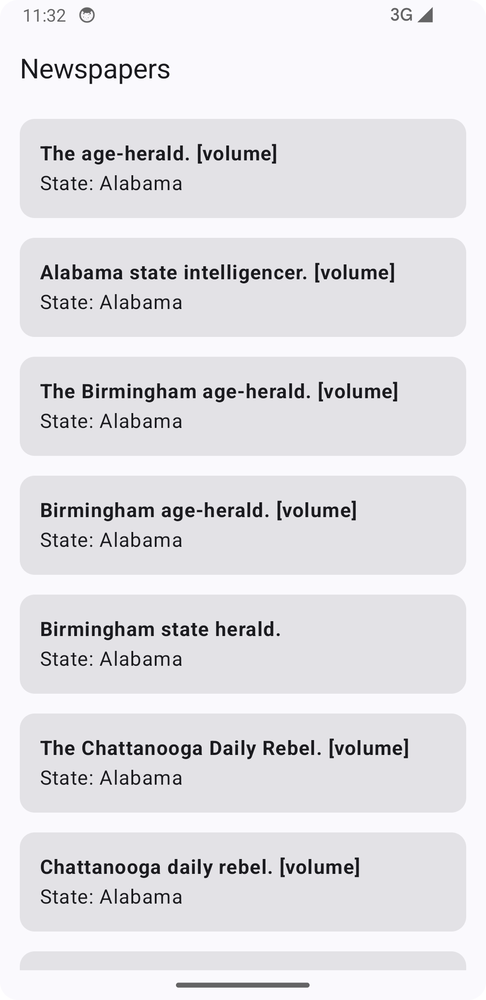

# ☄️ Android News App

An **Android News App** built with **Jetpack Compose**, **Retrofit**, **Hilt**, and **Coil**, using the [Chronicling America](https://chroniclingamerica.loc.gov/newspapers.json) API to fetch and display newspaper details.

## ✨ Features
- 📰 Browse a list of newspapers
- 🔍 View details of a selected newspaper
- 🌐 Fetch news data from **Chronicling America API** (No API key required)
- ⚡ Built with **Jetpack Compose** for a modern UI
- ⚙️ Dependency Injection using **Hilt**
- 🎭 Display newspaper thumbnails using **Coil**
- ⏳ Efficient network calls with **Retrofit** and **Coroutines**

## 🛠 Tech Stack
- **Kotlin** - Primary programming language
- **Jetpack Compose** - UI toolkit for building declarative UIs
- **Retrofit** - For making network requests
- **Hilt** - Dependency Injection
- **Coil** - Image loading library
- **Coroutines & Flow** - Asynchronous programming

## 🚀 Getting Started
### Prerequisites
- **Android Studio Flamingo** or later
- **Minimum SDK:** 23

### Setup
1. **Clone the repository:**
   ```sh
   git clone https://github.com/yourusername/NewsApp.git
   cd NewsApp
   ```
2. **Sync the project** in Android Studio and run the app on an emulator or a real device.

## 📷 Screenshots



## 🔧 Architecture
The project follows **MVI (Model-View-Intent)** architecture for better state management and scalability.

## 📘 API Usage
This app fetches newspaper data using **Chronicling America API**. No API key is required. More details available at [Chronicling America API](https://chroniclingamerica.loc.gov/).

## 👨‍💻 Author
**Ganesh Shirole** - [GitHub](https://github.com/ganeshshirole)

## 📚 License
This project is licensed under the **MIT License** - see the [LICENSE](LICENSE) file for details.

---
✨ *If you like this project, don't forget to ⭐ star the repo!*

